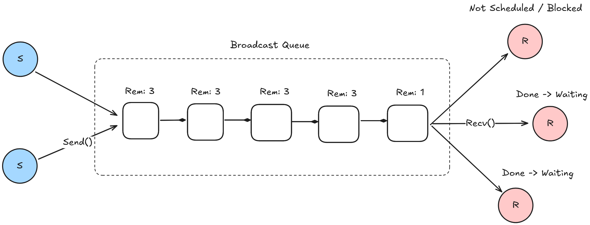
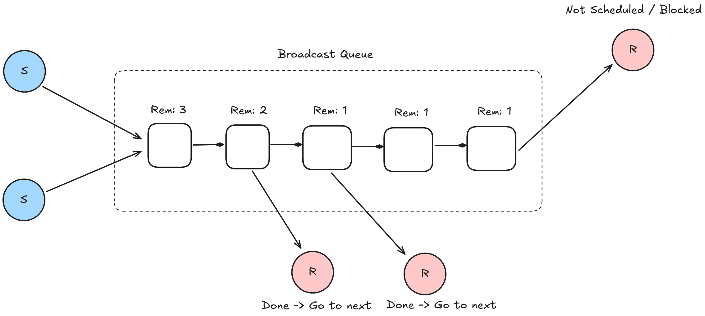
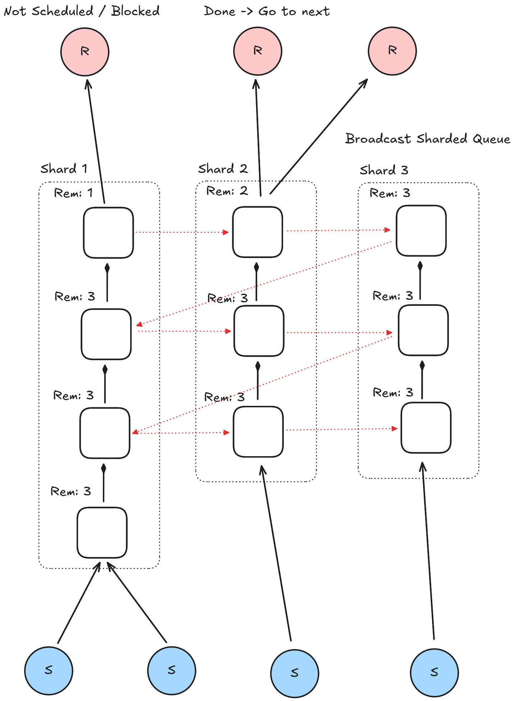

# Broadcast

## Async MPMC broadcast lock-free channel.

Inspiration - [link](https://docs.rs/tokio/latest/src/tokio/sync/broadcast.rs.html#312)

Lock-Free implementation of `tokio::sync::broadcast`

## Extra features
- Optional unbounded mode support

---

## Design variants

- Simple lock-free queue

  

- Simple lock-free queue (Readers do not wait each other)

  

- Sharded lock-free queue (Readers do not wait each other + sharded senders)

  

## Performance

TODO

## Reference
+ [The Art of Multiprocessor Programming by Maurice Herlihy & Nir Shavit](https://github.com/amilajack/reading/blob/master/Computer_Science/The%20Art%20of%20Multiprocessor%20Programming.pdf)

+ [Scalable Channel](https://arxiv.org/pdf/2211.04986)
